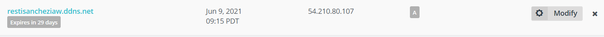

# Práctica HTTPS con Let's Encrypt y Certbot

## Pasos a realizar

### Paso 1

**Crear instancia EC2** en AWS con los siguientes puertos:
- SSH (22/TCP)
- HTTP (80/TCP)
- HTTPS (443/TCP)
- 
### Paso 2
**Obtener la dirección IP** de la instancia EC2 en AWS.

### Paso 3
**Realizar la instalación y configuración de un sitio web**. Utilizamos los scripts que tenemos de las prácticas anteriores.

### Paso 4

**Registrar un nombre de dominio** en algún proveedor de dominio gratuito. En mi caso en NO-IP.



**Configuramos los registros DNS del proveedor de nombres de dominio** para que el nombre del dominio que se ha registrado pueda resolver hacia la dirección pública de la instancia en AWS.

Como tenemos en el ejemplo de arriba.

### Paso 5

Realizamos la instalación y la configuración de **Docker y Docker-compose** en la instancia de AWS.

En el script creado para esta práctica podemos apreciar los siguientes pasos:

```
  
#!/bin/bash

# Actualizamos lista de repositorios
apt update 

# Actualizamos los paquetes
apt upgrade -y

# Instalamos docker

apt install docker -y

# Instalamos docker-compose

apt install docker-compose -y

```
### Paso 6 

**Modificar el archivo de `docker-compose.yml` de alguna de las prácticas anteriores para incluir el servicio de HTTPS-PORTAL**

```
version: '3.4'
services:
    https-portal:
      image: steveltn/https-portal:1 
      ports:
        - 80:80 
        - 443:443
      restart: always
      environment:
        DOMAINS: 'resti-docker.ddns.net -> http://prestashop:80'
        STAGE: 'production'
      networks:
        - frontend-network
```

### Pasos para no redirigir

1. Nos metemos a phpmyadmin
2. Vamos a SQL e introducimos:

```
UPDATE ps_configuration SET value = '1' WHERE name = 'PS_SSL_ENABLED';
UPDATE ps_configuration SET value = '1' WHERE name = 'PS_SSL_ENABLED_EVERYWHERE';
```
